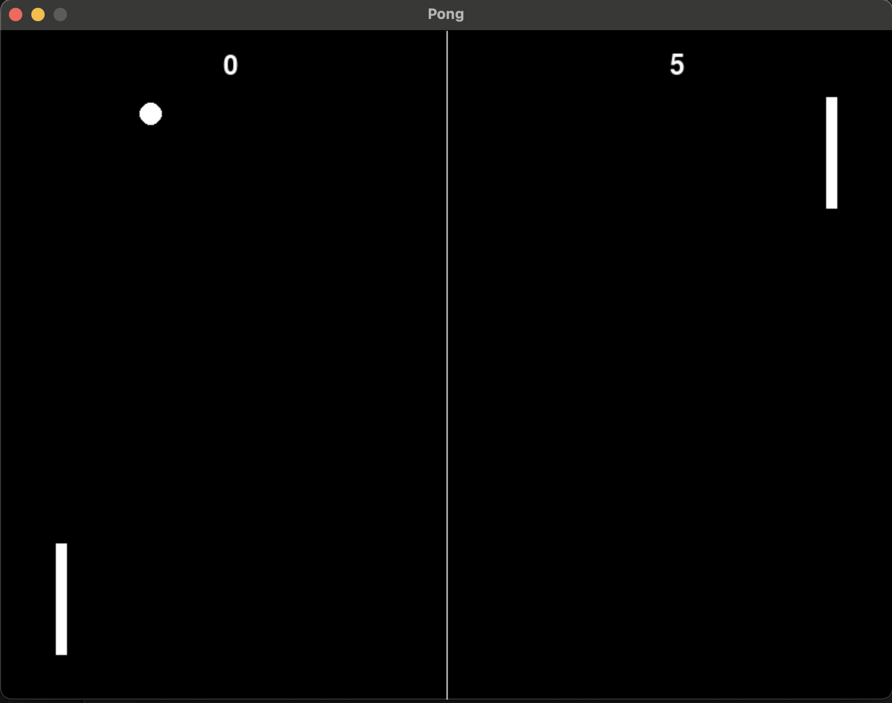

# Pong Agent with Reinforcement Learning

This project implements an AI agent to play a version of Pong using **PyTorch** and **PyGame**, utilizing reinforcement learning concepts. The agent learns to control the left paddle and maximize its score over training epochs by interacting with the environment.

## Features

1. **Reinforcement Learning Framework**:
   - The agent uses a policy gradient-based reinforcement learning approach.
   - Actions are sampled from a probability distribution generated by the neural network.

2. **Reward Mechanism**:
   - **+100 points** for scoring a goal.
   - **-500 points** for missing the ball.
   - **+50 points** for hitting the ball.
   - Small rewards or penalties for moving closer to or away from the ball to encourage strategic positioning.

3. **Training Process**:
   - Rewards are accumulated and discounted over time to emphasize future rewards.
   - The loss function uses the log-probabilities of the agent's actions, scaled by the discounted reward, to optimize the policy.

4. **Neural Network Design**:
   - **Input**: The state of the game (paddle position, ball position, and ball velocity).
   - **Output**: A probability distribution over possible actions (`up` or `down`).
   - **Architecture**: Fully connected layers with ReLU activations and a Softmax output layer.

5. **PyGame Visualization**:
   - Real-time display of the Pong game, including paddle and ball movements.
   - Scores for both the agent (left paddle) and the opponent (right paddle) are displayed.

## How It Works

1. The game starts, and the agent observes the game state: paddle position, ball position, and ball velocity.
2. The agent outputs probabilities for moving the paddle up or down.
3. An action is sampled from the probability distribution, and the paddle is updated accordingly.
4. Rewards are calculated based on the agent's actions and the game outcome.
5. At the end of each game, the agent uses the accumulated rewards to optimize its policy.

## Neural Network

The agent is implemented as a neural network with the following architecture:
- **Input Layer**: 5 features (paddle position, ball position, and ball velocity).
- **Hidden Layers**: Two fully connected layers with ReLU activations.
- **Output Layer**: A probability distribution over 3 actions (`up`, `down`, or `no action`) using a Softmax function.

## Reward System

The reward system incentivizes the agent to:
- **Score points** by returning the ball effectively.
- **Position itself optimally** near the ball to increase its chances of returning it.
- **Avoid penalties** by missing the ball or failing to move strategically.

## Usage

1. **Install Dependencies**:
   - PyTorch: `pip install torch`
   - PyGame: `pip install pygame`
2. **Run the Code**:
   - Execute the Python script to start training and visualizing the Pong game.

3. **Adjust Parameters**:
   - Modify hyperparameters like learning rate, discount factor, and paddle speed to experiment with different training behaviors.

## Visualization

The game interface includes:
- A dynamic Pong game environment with moving paddles and a bouncing ball.
- Real-time updates of scores for both the AI agent and the opponent.

## Future Enhancements

- Improve the reward function for more sophisticated strategies.
- Train the agent using more advanced reinforcement learning algorithms like DDPG or PPO.
- Add multiplayer support or implement a more competitive opponent.

---
